# CURRENT

This map shows where XP4Life is right now.

```mermaid
flowchart LR
    FOUNDATION["Foundation Built"]
    DOCS["Core Docs Updated"]
    PLUGINS["Foundation Plugins Installed"]
    MERMAID["Mermaid / Map Plugins Installed"]
    MENU["Menu Hub Restructure Complete"]
    MAPS["Maps Layer Complete For Baseline"]
    HEALTH["Reviews Centralized"]
    GITPREP["Git Baseline Awaiting Approval"]

    FOUNDATION --> DOCS
    DOCS --> PLUGINS
    PLUGINS --> MERMAID
    MERMAID --> MENU
    MENU --> MAPS
    MAPS --> HEALTH
    HEALTH --> GITPREP

    classDef complete fill:#2f7d32,stroke:#1f5c24,color:#ffffff;
    classDef progress fill:#7b3fb3,stroke:#4d2475,color:#ffffff;
    classDef upcoming fill:#e7e7e7,stroke:#9a9a9a,color:#333333;

    class FOUNDATION,DOCS,PLUGINS,MERMAID,MENU,MAPS,HEALTH complete;
    class GITPREP progress;
```

## Current Phase
Phase 2 is still in progress.

## Why Not Phase 3 Yet
Phase 3 should start after the first clean commit baseline exists. The vault is cleaned and reviewed; the remaining gate is explicit approval to stage and commit.
