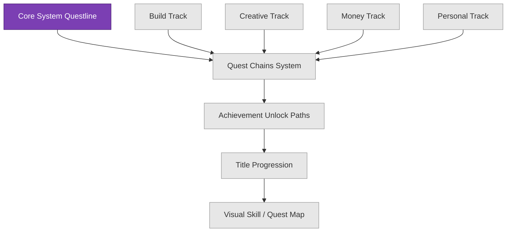

# QUEST CHAINS

Quest chains are not being built in detail yet. This note reserves the direction for Phase 4 so the current work stays scoped.

## Scope Rule
Do not build quest chains yet. Plan them only after:
- the first git baseline exists
- the dashboard is stable
- at least two real quest completion loops have been completed
- level and title rules are clearer

