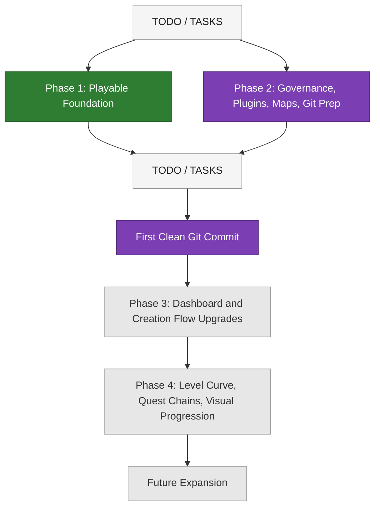

# ROADMAP

This map shows the current project path. Green means complete, purple means in progress, and grey means upcoming.

## Scope Gate
Phase 2 should not be considered complete until:
- required docs are current
- health review findings are triaged
- map layer exists
- obvious scratch/test artifacts are handled
- first commit inclusion rules are decided
- first baseline commit is created
