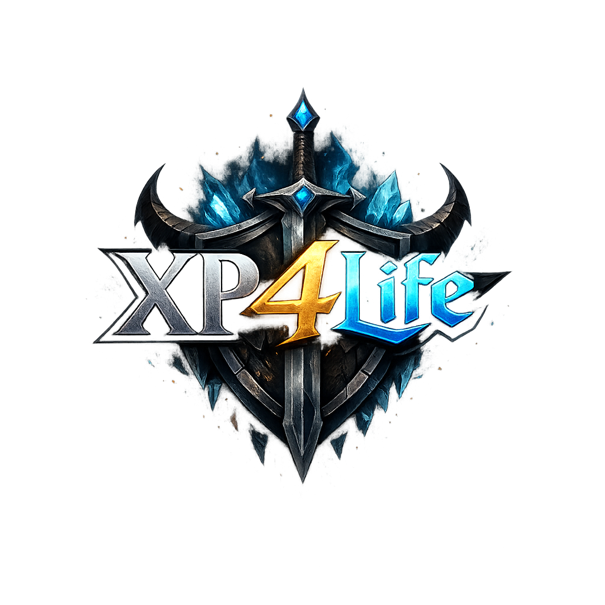
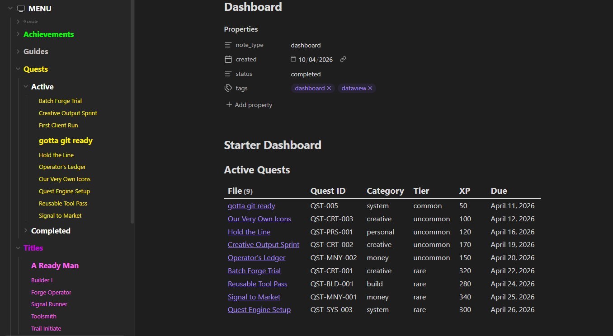
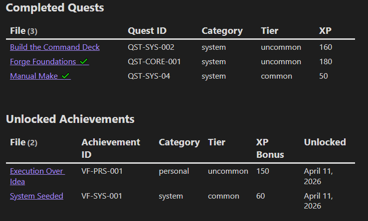
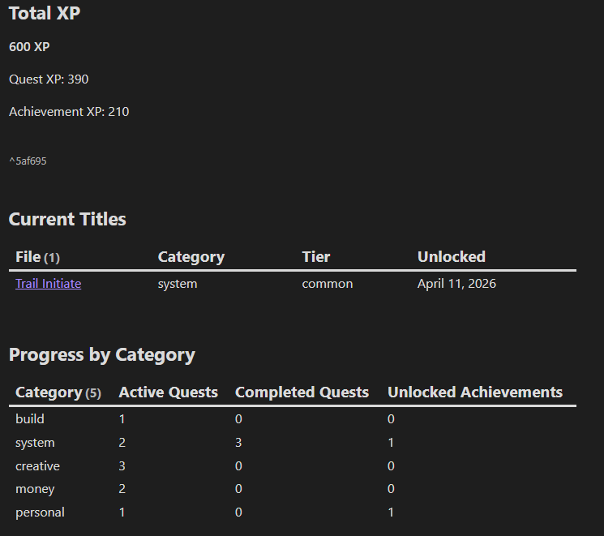
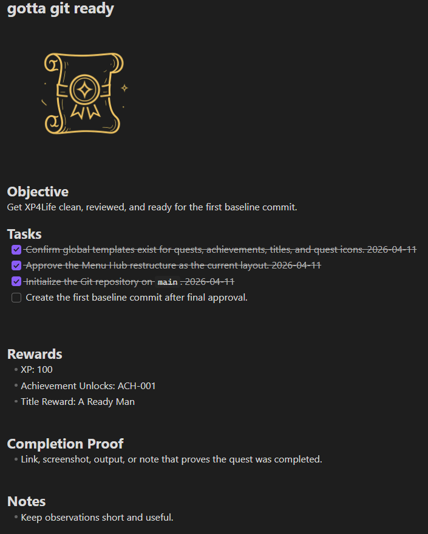
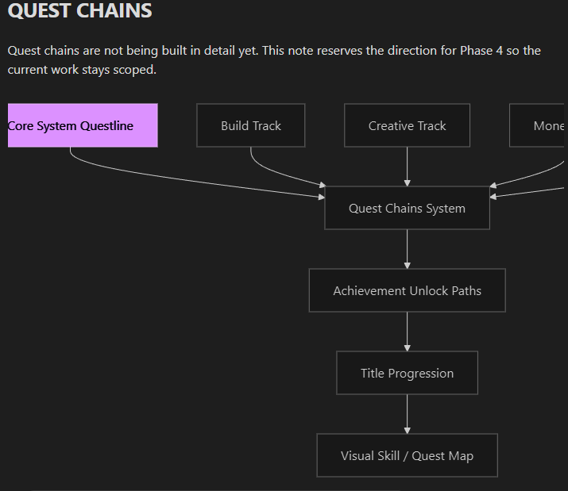
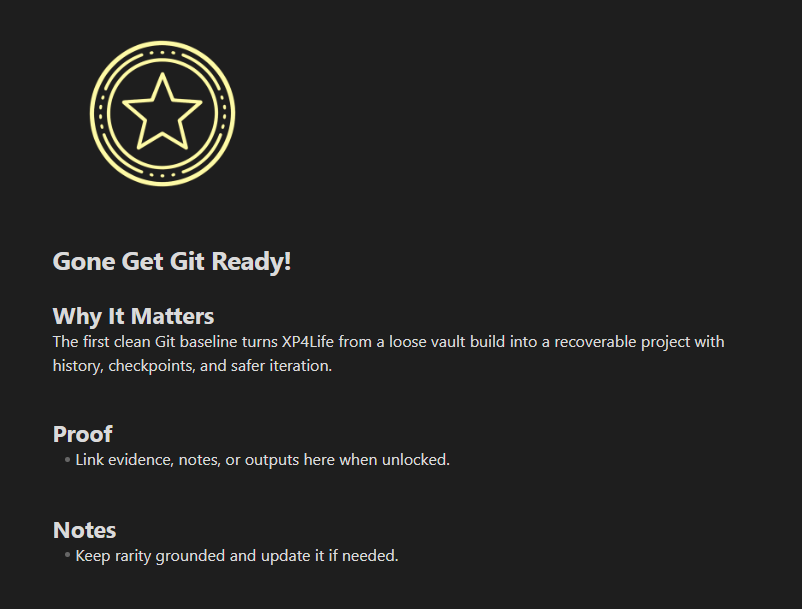
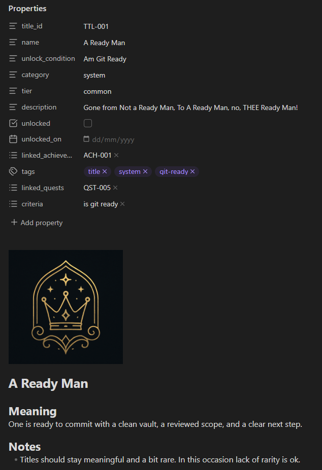
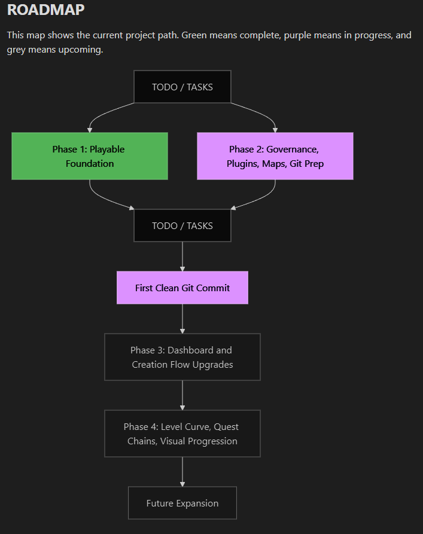

---
tags:
  - core
  - readme
---

# XP4Life

XP4Life is an Obsidian-based progression system that turns real work, project movement, creative output, money moves, and personal development into a playable structure.

It is built around this loop:

Tasks -> Quests -> Achievements -> XP -> Titles -> Progression

## What It Is
- Part RPG progression layer
- Part productivity system
- Part life operating system
- Part project tracker

## Core Principle
XP4Life must remain readable and usable with plain markdown, folders, and YAML.

Plugins are enhancement layers, not structural dependencies.

## Current State
- First-pass vault structure is in place.
- Starter quests, achievements, titles, templates, maps, and dashboard have been created.
- Root project docs define the system, plan, tracking, setup, and current phase.
- Quests, achievements, titles, dashboard, and user-facing guides now live under the Menu Hub.
- Current phase is Phase 2: governance, plugins, maps, and git-prep stabilization.

## Start Here
- Read [SYSTEM.md](SYSTEM.md)
- Review [PLAN.md](PLAN.md)
- Check [TASKS.md](TASKS.md)
- Open [🖥 MENU/Dashboard.md](🖥%20MENU/Dashboard.md)
- Review [MAPS/ROADMAP.md](MAPS/ROADMAP.md)
- Review [Core/Reviews/Vault Health Review - 2026-04-11.md](Core/Reviews/Vault%20Health%20Review%20-%202026-04-11.md)
- Use [🖥 MENU/Guides/XP4Life How-To.md](🖥%20MENU/Guides/XP4Life%20How-To.md) for practical daily operation and template use
- Review [🖥 MENU/Guides/Git Commit Policy.md](🖥%20MENU/Guides/Git%20Commit%20Policy.md) before the first commit

## Key Areas
- `🖥 MENU/Quests/` for missions and task execution
- `🖥 MENU/Achievements/` for milestone tracking
- `🖥 MENU/Titles/` for rank and identity rewards
- `🖥 MENU/Dashboard.md` for live views
- `🖥 MENU/Guides/` for day-to-day operating notes
- `MAPS/` for roadmap and project orientation diagrams
- `Core/` for planning and handoff notes
- `Core/Reviews/` for review snapshots and pre-commit health checks
- `Systems/` for plugin-aware and operating notes
- `Templates/` for global Templater-ready note templates
- `🖥 MENU/Guides/Tasks/` for Tasks plugin usage and tagging rules
- `🖥 MENU/Guides/Tables/` for XP and rarity mechanics

# Dashbaord Preview

___
## Make Quests

___

## Unlock Achievments

___
## Earn Titles

___
##  Where is this Heading?

____
--toakezg   
___
